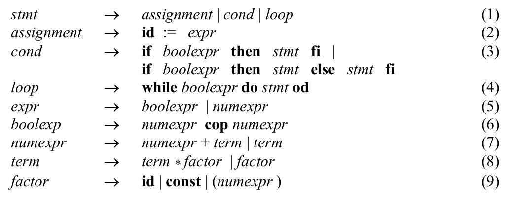

# 1810 - Übersetzerbau
Angelegt Samstag 26 August 2023

**KE1**

1. Sprung zu Selbsttestaufgaben mit Suche "Selbsttest"
2. Übersetzungsphasen
	1. Lexikalische Analyse
		1. Eingabe aus Sicht der Analyse eine Folge von Zeichen
		2. Erkennung von Grundsymbolen wie zB begin, if, Variablennamen, numerische Konstanten
	2. Syntaxanalyse
		1. hierarchische Strukturen erkennen
	3. Semantische Analyse
	4. Erzeugen von Zwischencode
	5. Codeoptimierung
	6. Codeerzeugung
3. Beispielzeichenketten (Lexeme)
	1. Integer, Real, Boolean, String, Symbol, Text
	2. Symbol -> Bezeichner in Programmmiersprachen oder nur aus bestimmten Sonderzeichen bestehend
	3. other steht für alle Zeichen, für die nicht andere Übergänge aus diesem Zustand definiert sind. Nach dem Erreichen des Endzustandes muss daher der Eingabezeiger um ein Zeichen zurückgesetzt werden, damit dieses Zeichen noch in das nächste Token eingehen kann.
4. Implementierung Scanner
	1. zwei Zeiger -> start_pos und pos (Integer)
	2. Variablen -> start_state, state (Integer)
	3. Funktionen -> nextchar(), stepback, gettoken(), isdelim() - Behandlung von Leerraum, isdigit()
	4. Parserregeln
		1. BOOLEAN muss vor SYMBOL untersucht werden, da die Darstellungen von TRUE und FALSE auch der Symbol-Struktur entsprechen.
		2. OPENTEXT und CLOSETEXT müssen vor SYMBOL untersucht werden, da sonst die Zeichenfolgen „<“ und „</“ als SYMBOL erkannt würden.
		3. REAL muss vor INTEGER untersucht werden, da die Integer-Struktur ein Präfix der Real-Struktur darstellt, also sonst ein Anfangsstück einer Real-Dar-stellung als Integer erkannt würde.
		4. häufig benutzte Token kommen zuerst in den cases der switch Funktion
		5. Die Funktion wird jeweils aufgerufen, wenn innerhalb eines Zustandsdiagramms kein Übergang mehr möglich ist. Dann wird der Eingabezeiger pos zurückgesetzt und anhand des gemerkten Anfangszustands für das aktuelle Diagramm der Anfangszustand für das nächste Diagramm gesetzt und als Folgezustand zurückgegeben.
	5. 

**KE2**

1. Syntaxanalyse
	1. Ziel -> Syntaxbaum [/Ableitungsbaum](file:///Ableitungsbaum) berechnen
2. reduzierte kontextfreie Grammatik -> ohne unerreichbare oder unproduktive Nichtterminale
3. ein Weg Ableitungsbaum zu zeichnen -> am weitesten links stehendes Terminal unterstreichen und im Baum Ersetzung einzeichnen
	1. am weitesten rechts stehendes ist auch eine Möglichkeit
	2. Linksableitung und Rechtsableitung
	3. Top-Down Analyse nutzt Linkableitung - Bottom-Up Analyse nutzt Rechtsableitung

